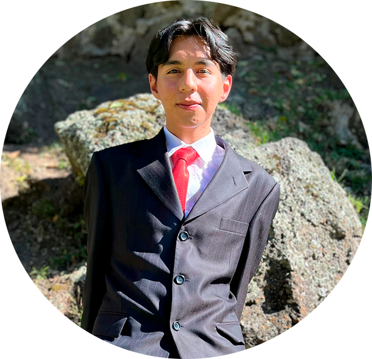
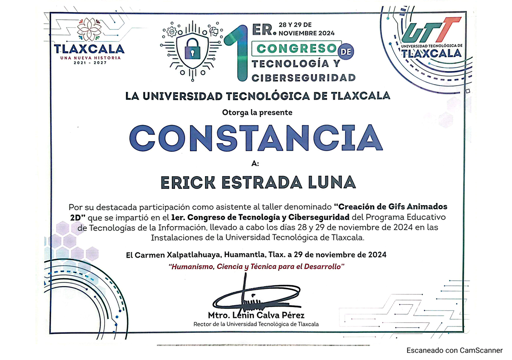
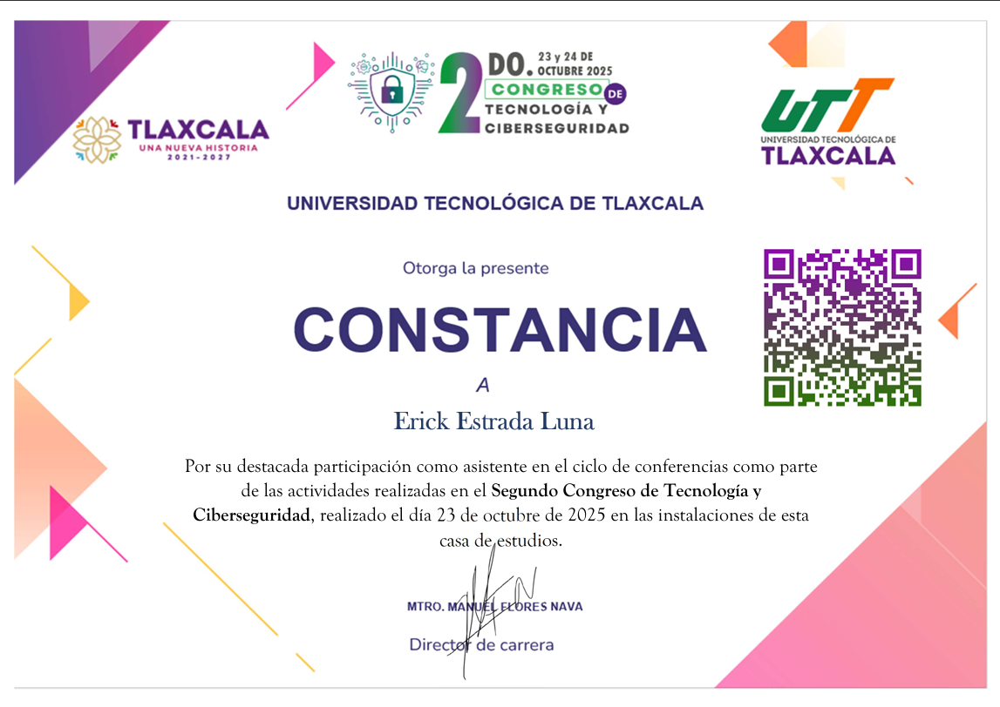
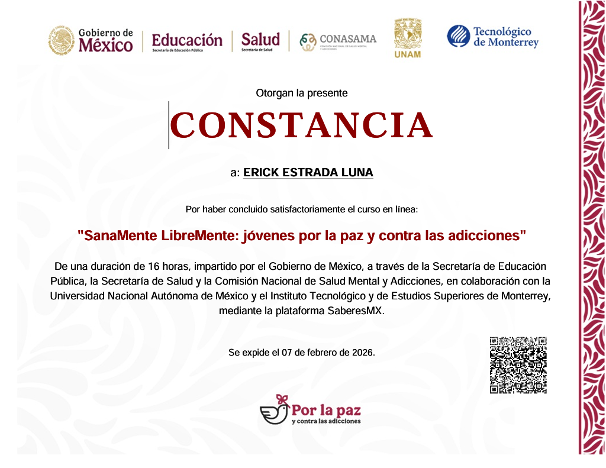
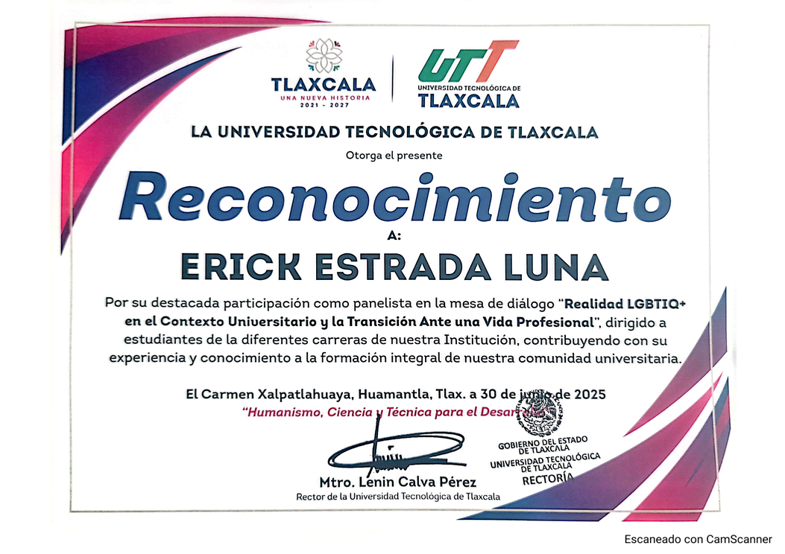
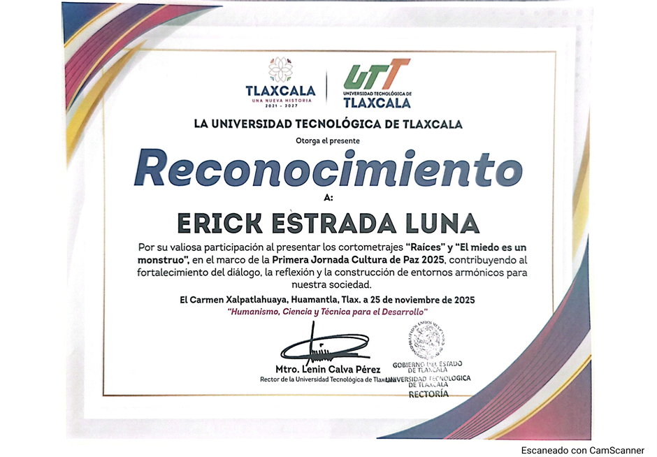
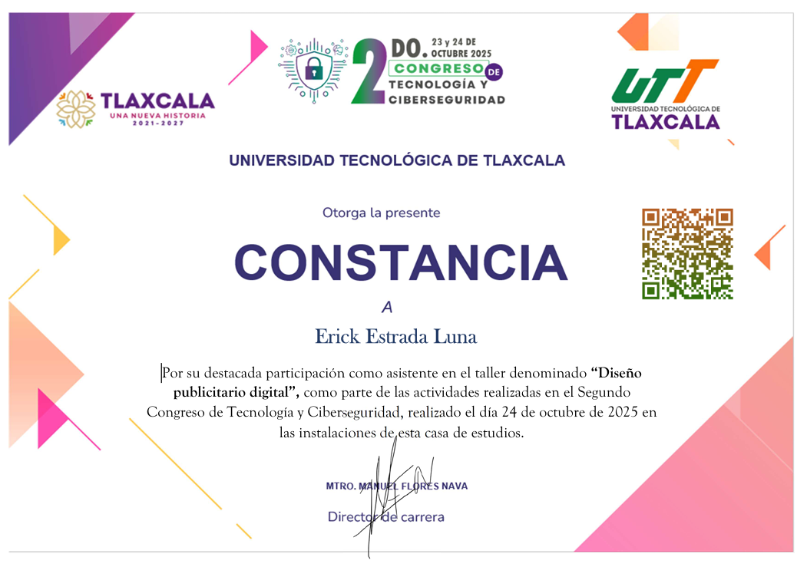
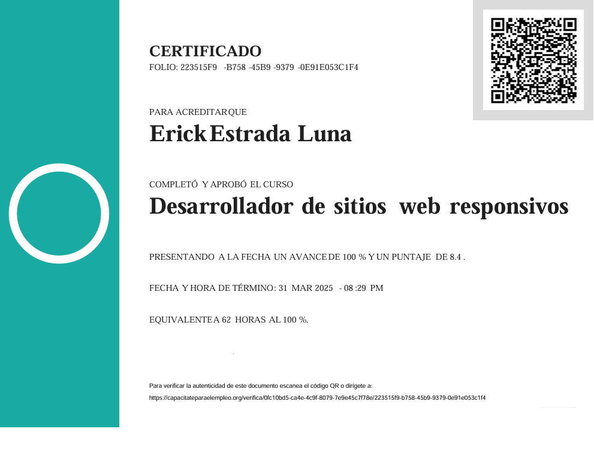

  

  

<h1 align="center">Holaaa!, soy Erick Estrada</h1>

# Sobre mí

Soy estudiante de **Entornos Virtuales y Negocios Digitales** apasionado por la tecnología y la creación de **experiencias digitales interactivas**, especialmente en **Realidad Virtual (VR)** y **Realidad Aumentada (AR)**. Me interesa combinar **programación, diseño y creatividad** para desarrollar proyectos innovadores y educativos.

Durante mi formación he participado en el desarrollo de **sistemas de software, aplicaciones interactivas y proyectos audiovisuales**, lo que me ha permitido fortalecer tanto mis habilidades técnicas como creativas.

A nivel personal, me considero una persona **responsable, comprometida y con interés constante por aprender**, siempre buscando mejorar mis habilidades y seguir creciendo en el área del desarrollo de software.

---

# 📫 Contacto

📧 Email  
erickesluutt06@gmail.com  

🐙 GitHub  
https://github.com/erickito1169

---

# 🛠️ Tecnologías y herramientas

## 👨‍💻 Lenguajes

## ⚙️ Desarrollo

## 🎨 Diseño y multimedia

## 🤝 Habilidades personales

- Trabajo en equipo
- Organización y responsabilidad
- Resolución de problemas
- Aprendizaje continuo
- Creatividad en proyectos tecnológicos

---

# 📂 Proyectos

## 🕯️ Sistema de Inventario y Catálogo Digital – **ALUMA**

Sistema desarrollado en **Python** para la gestión de inventario del negocio **ALUMA**, dedicado a la venta de velas y productos artesanales.

El sistema permite llevar un control de los productos disponibles, registrar ventas y administrar el inventario de manera eficiente.  
Como complemento del sistema también se desarrolló un **catálogo digital** para la visualización de los productos del negocio.

**Características**

- Registro de productos  
- Control de inventario  
- Registro de ventas  
- Visualización de productos mediante catálogo digital  

**Tecnologías utilizadas**

- Python  
- Visual Studio  

🔗 Proyecto  
[Ver proyecto](https://drive.google.com/drive/folders/1PPTuQRVx7wR7JslB0y-ZqlPIZb7BcXQ9?usp=drive_link)

---

## 🎬 Cortometraje – **Raíces**

Cortometraje titulado **"Raíces"**, el cual aborda la **discriminación hacia una mujer indígena al llegar a la ciudad**, con el objetivo de generar reflexión sobre la desigualdad y las problemáticas sociales que enfrentan muchas mujeres.

**Herramientas utilizadas**

- Adobe Premiere Pro (edición de video)  
- Adobe Audition (edición y limpieza de audio)

🔗 Proyecto  
[Ver material](https://drive.google.com/drive/folders/1oF3IY7xUqgzGdDQnUoW2LwZ5z4Dxvbvv?usp=drive_link)

---

## 🎥 Cortometraje Animado – **El Valor de Decirlo**

Cortometraje animado titulado **"El Valor de Decirlo"**, enfocado en la **concientización sobre el bullying o acoso escolar**, mostrando la importancia de denunciar estas situaciones y fomentar el respeto entre estudiantes.

**Herramientas utilizadas**

- Krita (ilustración y animación)  
- Adobe Premiere Pro (edición de video)  
- Adobe Audition (edición de audio)

🔗 Proyecto  
[Ver material](https://drive.google.com/drive/folders/1hiddQFgnQmx5-l4keN0NNxzf56r4OAx-?usp=drive_link)

---

## 🎨 Carteles Promocionales – **25 de Noviembre**

Diseño de carteles promocionales realizados para la campaña del  
**25 de Noviembre – Día Internacional de la Eliminación de la Violencia Contra la Mujer**, con el objetivo de generar conciencia social sobre esta problemática.

**Herramientas utilizadas**

- Adobe Photoshop

🔗 Proyecto  
[Ver diseños](https://drive.google.com/drive/folders/1UxyOXIzfdyPhoGH2mWufwnfHXuFpmHF-?usp=drive_link)

---

<h1 align="center">🏅 Reconocimientos y Certificaciones</h1>

# 📚 Actualmente aprendiendo

- Desarrollo de **experiencias VR**
- **Optimización de proyectos en Unity**
- **Modelado 3D en Blender**
- Desarrollo de **aplicaciones interactivas**

---

# 🎯 Objetivos

✔ Participar en proyectos de desarrollo de software  
✔ Mejorar habilidades en **VR y AR**  
✔ Colaborar en **proyectos open source**  
✔ Crear experiencias educativas interactivas  

---

 

